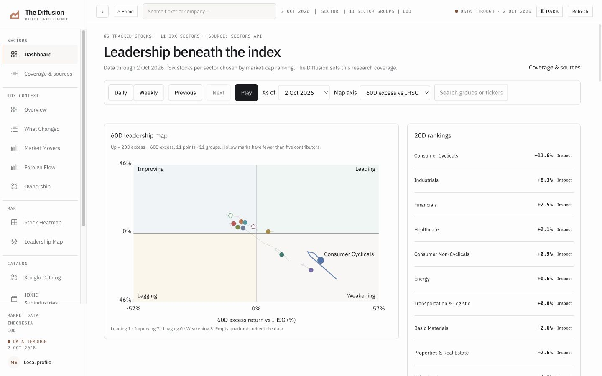
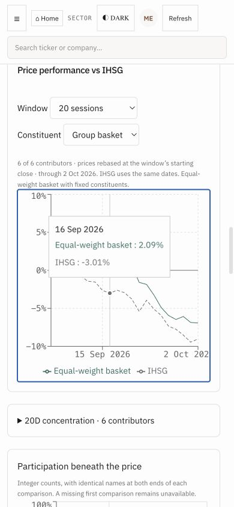

# Final repair verification · 8 October 2026

The verified successor is `rel-64026e36d49733009fec952086fc95a3121a86efbb196b1c68d00fd6317f33d2`.
Browser QA is bound to source `2e6c516c3254bbae0d380491487181bae1867f7b`
and manifest `98e2c260c9afae07ce2b1cb5b5436cda8bbff9978a0239d809d909183ad36e4f`.
Later documentation/publication commits leave the tested source unchanged.

| Verification | Evidence |
| --- | --- |
| Python | [932 passing tests](python-checks.txt), two existing deprecation warnings |
| Frontend | [Typecheck](frontend-typecheck.txt) and [build](frontend-build.txt) pass; existing build size/configuration warnings retained |
| Native arithmetic | [Independent native oracle](sectors-oracle.json): zero mismatches, including action exclusions and actual 20D concentration |
| Broader group arithmetic | [Independent reading oracle](reading-oracle.json): zero mismatches across 18,096 horizon values, 696 cohort lists, 22,620 map values, and 4,524 each of leadership, concentration, and diffusion observations |
| Integer diffusion | [Independent count oracle](diffusion-count-oracle.txt): 174 groups, 3,654 daily and 870 weekly observations, zero mismatches |
| Market breadth | [Retained price-panel oracle](market-breadth-oracle.json): all four horizons pass; the underlying market/breadth inputs are unchanged |
| Clean checkout | [Exact rebuild](clean-reproduction.json): both analysis assets reproduce from the exact source commit with credentials unset and zero provider calls |
| Browser | [21 passing checks](browser-qa.json), actual required viewport dimensions, all fifteen visible navigation routes, no unexpected normal-page console errors |
| Acquisition preservation | [479 pre-publication files unchanged](preservation-prepublication.json); after activation only the active pointer changes |
| Package validation | [All assets validate](release-validation.json), original 478 protected data/package files remain unchanged |
| Credential review | [Git tree/history scan](credential-review.json), no issued-token or configured-secret matches; pattern-based review has stated limits |

The browser exercised all eleven native sectors and all 66 distinct
constituents, 21 daily dates and five weekly dates, playback, group comparison,
constituent selection, dated chart inspection, and group/ticker navigation.
All eleven rankings and eleven points render; nine satisfy the five-contributor
floor and two are descriptive. Twenty-three stock YTD readings retain their
own 2 October end date during earlier selections.

The broader maps include all valid points: eleven sectors, 46 Konglo lenses,
99 IDXIC groups, and fifteen themes. The catalogue retains all 34 reference
labels and all existing identifiers. Source-linked holdings, affiliation, and
control remain distinct; reference-label coverage does not imply full family
holdings coverage. Ownership checks include BBRI's genuine share change,
small nonzero percentage-point changes, separate 5% prior-share disclosures,
and unavailable prior percentages. Weekly summary, tables, counts, and breadth
curves use the same contract. Replay persistence counts only dates already
reached. Context baskets use the same eligible horizon names as their readings.

Loading, deliberate HTTP 503, Retry recovery, absent analysis, corrupt analysis,
missing selection evidence, corrupt YTD evidence, and current points without
history were exercised. Corrupted native evidence blocks the primary workflow.
Stopped serving causes browser connection refusal; restarting and a fresh
localhost tab recovers. Deliberate fault logs are separated from normal checks.
Screenshot viewport metadata and hashes identify the actual image dimensions;
only the four `sectors-…` images constitute the required viewport matrix.

The [readiness receipt](readiness.json) reports `VERIFIED_LOCAL_BUILD`, with a
separate [publication record](publication.json). It authorizes no paid calls.
The original acquisition budget and all historical receipts remain intact.
Public hosting is accepted only after a successful Vercel launch and fresh
public checks; consult [launch evidence](launch.json). Videos, social publishing,
KSEI composition, scripless-conversion analysis, and final submission are deferred.
